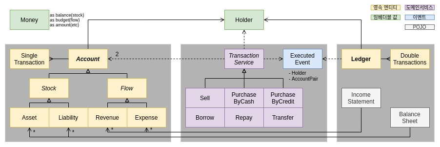

# 회계 서버 

API 서버 / 개인 / 2021. 3 - 4 / [웹사이트](https://scene.gq) [API문서](https://accounting.scene.gq)  
자바, 스프링, JPA / 도커, ec2, nginx, https

복식부기 가계부 회계 서버입니다.   
[웹 프론트엔드](https://github.com/suloginscene/web-frontend) 가 사용하며,
[공통 컴포넌트](https://github.com/suloginscene/common) 에 의존하고 있습니다.

서비스 내용에 관해서는 [웹사이트](https://scene.gq) 메인화면을, API에 관해서는 [API문서](https://accounting.scene.gq)를 참고해 주세요.

---

### 계정

- 타입 계층  
  Account는 단식 거래기록과 그 접근 메서드(사본 반환)를 정의합니다. Stock(저량)과 Flow(유량)는 제공하는 인터페이스가 서로 다릅니다. 구체타입인 자산과 부채, 수입과 지출은 다형성보다는 표현력을
  위해 작성하였습니다.
- 벌크 연산  
  계정은 애그리거트 루트입니다. 계정 삭제 시 고아 객체인 거래기록들을 1회의 쿼리로 삭제하기 위하여 벌크 연산을 사용하였습니다.

### 거래

- 도메인 서비스  
  거래서비스는 두 계정 간의 거래를 처리하는 도메인 서비스입니다. 각 계정에 단식 거래기록을 더하고, 이벤트를 통해 소유자 장부에 복식 거래기록을 추가합니다.
- 다형성  
  템플릿메서드 패턴으로 흐름을 정의하고 구체 클래스에서 서로 다른 로직을 구현합니다. 이 때 검증 및 표현을 위해 계정을 구체 타입으로 변환합니다. 변환 실패 시 잘못된 사용임을 알리는 예외를 던집니다.
- 객체 공유  
  거래서비스 객체는 stateless 하지만, 메서드는 stateful한 매개변수의 상태를 변경하므로 부수효과는 갖습니다. 이 경우 스레드 안전성이 깨지는 지점은 거래서비스가 아니라, 메서드 매개변수인 계정이라고
  생각했습니다. 계정에 관한 접근은 트랜잭션으로 관리되므로 안전하다고 판단했고, 거래서비스의 각 구현체는 싱글턴 컨테이너 역할을 하는 스프링 빈을 통해 공유하였습니다.

### 보고서

- 이벤트 소싱과 CQRS  
  정석적인 구현은 아니지만, 거래 기록을 다루며 이벤트 소싱과 CQRS의 아이디어를 일부 참고하였습니다. Ledger(장부)는 거래서비스가 발행한 이벤트를 더하기만 하는 읽기 전용 객체입니다. 재무상태표(
  BalanceSheet)와 손익계산서(IncomeStatement)는 관련 계정의 단식 거래기록을 재생하여 구성됩니다.
- 성능 개선 가능성  
  스냅샷은 현재 활용하지 않고 있는데, 재무상태표에는 필요하다면 적용할 수 있을 것 같습니다. 그러나 손익계산서의 경우에는 기간 개념이 있는 유량의 특성상 스냅샷을 활용하기 어려워 보입니다. 성능 개선이 필요하다면
  거래기록이 차례대로 입력되었으므로 이진탐색을 통해 조회기간 내 기록을 추출할 수 있으리라 생각합니다.

---

### HATEOAS

- 웹  
  웹을 거대한 분산 시스템으로 이해하는 관점에 큰 흥미를 느낍니다. 이를 올바르게 활용하고자 적절한 HTTP 메서드와 상태코드를 사용하고자 노력했습니다. 그러나 URL에 관해서는 실용적인 이유로 정석을
  벗어났습니다. 이 서비스는 인증된 사용자를 대상으로 하므로 URL 자체가 고유한 리소스를 가리키지 않더라도, 인증정보와 결합하여 고유한 리소스를 가리키면 충분하다고 생각했습니다. 이 편이 소스코드에서 권한검증
  로직을 줄일 수 있으므로 이 방식을 선택하였습니다.
- HATEOAS  
  API 응답은 hal+json 형식으로 해당 리소스에 관해 필요한 링크를 제공합니다. 엄격한 의미에서 충분한 링크를 제공하는지에 관해서는 확신이 없으나, 유일한 허용 Origin인 웹 프론트엔드에서는 오직 서버의
  주소만을 아는 상태에서 모든 기능을 이용할 수 있었습니다. 이 방식을 사용함으로써 프론트엔드가 백엔드에 결합되는 정도가 낮아짐을 느꼈습니다. 한편 일반 사용자용 API가 아니므로 Self descriptive는
  고려하지 않았습니다. API문서는 응답 표현에 포함되지 않으며, 서버의 루트에서 확인할 수 있습니다.

### 테스트

- 계층별 테스트  
  테스트 주도 개발을 지향합니다. 이전 프로젝트에서 컨트롤러 중심의 TDD를 시도하다가 깨지기 쉬운 테스트 문제를 경험하였기에, 계층별 테스트를 작성하였습니다. 도메인 계층은 로직을, 응용 계층은 쿼리를, 표현
  계층은 API를 중심으로 테스트하였고, 필요한 assert 만을 사용하고자 했습니다. 윤곽이 잡힌 후 서비스 전체의 흐름을 나타내기 위해서 시나리오 테스트를 작성하였습니다.
- 추상 테스트 클래스  
  테스트와 운영의 트랜잭션 범위가 달라지지 않도록 @Transactional을 사용하는 대신 추상 테스트 클래스를 부모로 하여 저장소를 관리하였습니다. 이 클래스에서 DB에 관한 given, sync, clear를
  처리하도록 하여 JPA 쿼리 확인을 위한 로깅도 처리하였습니다.

### 운영

- 배포  
  비용 절감을 위해 다양한 고민을 하였습니다. 우선 머신의 수를 줄이기 위해 nginx의 가상 호스트를 서브 도메인으로 분기하도록 설정하였습니다. 또한 사양과 CPU 사용량을 줄이기 위해 운영서버에서의 메이븐
  빌드가 아닌 도커 컨테이너 배포를 선택하였습니다. 로컬의 배포 스크립트로 이미지 빌드 후 도커 허브에 push, 운영의 실행 스크립트로 pull 후 프로퍼티 경로 마운트하여 실행하도록 하였습니다. 1G 메모리
  인스턴스에 2개의 서버 애플리케이션이 동작하니 OOM으로 추정되는 도커 컨테이너 종료가 일어났습니다. 도커 자원 제한과 리눅스 SWAP 관련 일부 설정을 하였고, 조정하지는 않았지만 JVM 옵션도 살펴보는 계기가
  되었습니다.
- 보안  
  https를 위해 certbot을 활용해 letsencrypt 인증서를 nginx에 적용하고 프록시로 도커에 연결하였습니다. 처음에는 인증서를 키 스토어로 추출하여 톰캣 자체에 https를 적용해 보기도
  하였으나, 간편한 프록시 방식에 비해 이점을 느끼지는 못했습니다. 공통 컴포넌트의 CORS 설정은 프론트엔드의 origin만을, 데이터베이스 포트는 API 서버의 ip만을 허용하도록 설정하였습니다.
